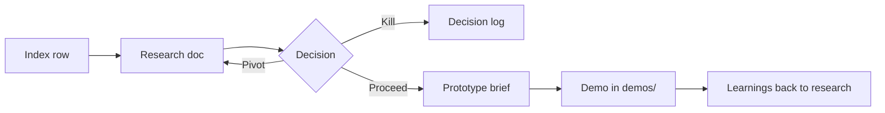

# Karn × Will Venture Playbook

Efficient loop for exploring business ideas and building throwaway prototypes together.

## Principles

1. **One artifact per phase** — Index row → research doc → decision → prototype brief → demo code. Do not skip phases to "just build."
2. **Owner drives, partner reviews** — The Owner (see `ideas/README.md`) drafts; the other person’s job is challenge, not rewrite.
3. **Time-box** — Research: 1–2 sessions. Decision: 30 minutes. Prototype scope: 1 session. Build: days, not weeks.
4. **Kill early** — A killed idea with a written reason is success, not failure.
5. **Integrate in the open** — All thinking lives in this repo so async handoffs work.

## Pipeline



| Phase | Output | Who | Cursor skill |
|-------|--------|-----|----------------|
| 0. Capture | Row in `ideas/README.md` | Either | — |
| 1. Research | `ideas/<slug>-research.md` | Owner | `@venture-research` |
| 2. Decide | `ideas/decisions/<date>-<slug>.md` | Both | `@venture-decision` |
| 3. Scope prototype | `ideas/<slug>-prototype-brief.md` | Owner | `@venture-prototype-scope` |
| 4. Build | `demos/<slug>/` | Whoever has bandwidth | `@venture-prototype-build` |
| 5. Retro | Update research "Next Steps" + decision if needed | Both | `@venture-research` |

## Folder layout

```
karn-will-playground/
├── PLAYBOOK.md                 ← you are here
├── ideas/
│   ├── README.md               ← index (always current)
│   ├── templates/              ← copy, don’t edit in place
│   ├── decisions/              ← kill / proceed / pivot records
│   └── *-research.md           ← deep dives
├── demos/
│   └── <slug>/                 ← throwaway prototypes only
└── .cursor/skills/             ← agent workflows per phase
```

## Session types (use these with your friend)

### Async handoff (default)

1. Owner pushes research or prototype brief.
2. Partner leaves **inline comments** in the doc (GitHub PR review or shared edit).
3. Owner schedules a **30-min decision call** only when comments converge or block.

### Live working session (2 hours max)

| Block | Activity |
|-------|----------|
| 0:00–0:15 | Re-read Executive Summary + Open Questions |
| 0:15–0:45 | `@venture-decision` prep → discuss Kill / Pivot / Proceed |
| 0:45–1:30 | If Proceed: `@venture-prototype-scope` → agree on wedge |
| 1:30–2:00 | Assign Owner for demo; set date for retro |

### Weekly rhythm (optional)

- **Monday**: Scan index — anything stale >2 weeks without a decision?
- **Wednesday**: One prototype build block (whoever owns the demo).
- **Friday**: 15-min retro — update Next Steps in research doc.

## Definition of done

| Artifact | Done when |
|----------|-----------|
| Index row | Name, 1–2 sentence description, Owner, link or "TBD" |
| Research | All sections in template filled; status line at bottom |
| Decision | Explicit verdict + dated; linked from index if killed |
| Prototype brief | Wedge, non-goals, demo script, ≤2 week build estimate |
| Demo | Runs locally; README with demo script + what we learned |

## Naming conventions

- Research: `ideas/<product-slug>-research.md` (e.g. `source-referral-crm-research.md`)
- Prototype brief: `ideas/<product-slug>-prototype-brief.md`
- Demo folder: `demos/<product-slug>/` (kebab-case, match research slug)
- Decisions: `ideas/decisions/YYYY-MM-DD-<slug>.md`

## Using Cursor skills

Invoke by name in chat (e.g. "use venture-research on idea X") or `@` mention if your client supports it.

| Skill | Use when |
|-------|----------|
| `venture-research` | New idea depth, expand index row, refresh after customer calls |
| `venture-decision` | Ready to kill, pivot, or commit to prototype |
| `venture-prototype-scope` | Proceed verdict — define smallest demo |
| `venture-prototype-build` | Brief approved — implement under `demos/` |

Start a thread with: **phase, idea slug, Owner, and what changed since last time.**
